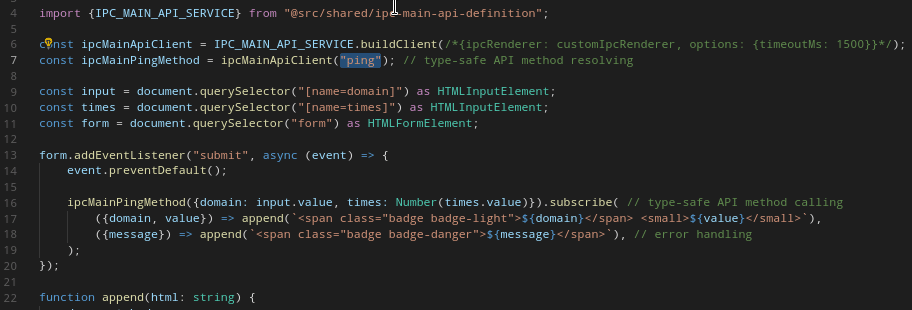

# electron-rpc-api

[](https://github.com/vladimiry/electron-rpc-api/actions)

Is a wrapper around the Electron's IPC for building type-safe API based RPC-like and reactive interactions.

You describe an API structure and communication channel only once creating an API Service instance and then you share that instance between provider and client. It means that API method names and types of the input/return parameters on the client side are the same as on the provider side, so you get a type-safety on both sides having no overhead in runtime, thanks to TypeScript.

The module provides `createIpcMainApiService` and `createWebViewApiService` factory-like functions that can be used to create respective service instances.

## Getting started

Your project needs `rxjs` module to be installed, which is a peer dependency of this project.

Method resolving and method calling are type-safe actions here:



`IpcMainApiService` usage example is shown below. It's based on the [example app](example/electron-app), so you can jump there and run the app.

- First of all an API structure needs to be defined ([example/electron-app/src/shared/ipc-main-api-definition.ts](example/electron-app/src/shared/ipc-main-api-definition.ts)):
    ```typescript
    // no need to put API implementation logic here
    // but only API definition and service instance creating
    // as this file is supposed to be shared between the provider and client implementations
    import {ActionType, ScanService, createIpcMainApiService} from "electron-rpc-api";
    
    const apiDefinition = {
        ping: ActionType.SubscribableLike<{ domain: string, times: number }, { domain: string, value: number }>(),
        sanitizeHtml: ActionType.Promise<string, string>(),
        quitApp: ActionType.Promise(),
    };
    
    export const IPC_MAIN_API_SERVICE = createIpcMainApiService({
        channel: "some-event-name", // event name used to communicate between the event emitters
        apiDefinition,
    });
    
    // optionally exposing inferred API structure
    export type ScannedIpcMainApiService = ScanService<typeof IPC_MAIN_API_SERVICE>;
    ```

- API methods implementation and registration in `main` process using previously created `IPC_MAIN_API_SERVICE` service instance ([example/electron-app/src/main/ipc-main-api.ts](example/electron-app/src/main/ipc-main-api.ts)):
    ```typescript
    import sanitizeHtml from "sanitize-html";
    import tcpPing from "tcp-ping";
    import {app} from "electron";
    import {interval} from "rxjs";
    import {map, mergeMap, take} from "rxjs/operators";
    import {observableToSubscribableLike} from "electron-rpc-api";
    import {promisify} from "util";
    
    import {IPC_MAIN_API_SERVICE, ScannedIpcMainApiService} from "src/shared/ipc-main-api-definition";
    
    export function register(): ScannedIpcMainApiService["ApiClient"] {
        const api: ScannedIpcMainApiService["ApiImpl"] = {
            ping: ({domain, times}) => {
                return observableToSubscribableLike(
                    interval(/*one second*/ 1000).pipe(
                        take(times),
                        mergeMap(() => promisify(tcpPing.ping)({address: domain, attempts: times})),
                        map(({avg: value}) => {
                            if (typeof value === "undefined" || isNaN(value)) {
                                throw new Error(`Host "${domain}" is unreachable`);
                            }
                            return {domain, value};
                        }),
                    )
                );
            },
            async sanitizeHtml(input) {
                return sanitizeHtml(
                    input,
                    {
                        allowedTags: sanitizeHtml.defaults.allowedTags.concat(["span"]),
                        allowedClasses: {
                            span: ["badge", "badge-light", "badge-danger"],
                        },
                    },
                );
            },
            async quitApp() {
                app.quit();
            },
        };
    
        IPC_MAIN_API_SERVICE.register(api);
    
        return api;
    }
    ```

- Exposing the API Client factory function to `renderer` process as `window.__ELECTRON_EXPOSURE__` property using `contextBridge.exposeInMainWorld` call in `preload` script ([example/electron-app/src/renderer/browser-window-preload/index.ts](example/electron-app/src/renderer/browser-window-preload/index.ts)):
    ```typescript
    import {contextBridge} from "electron";
    
    import {ElectronWindow} from "src/shared/model";
    import {IPC_MAIN_API_SERVICE} from "src/shared/ipc-main-api-definition";
    
    const electronWindow: ElectronWindow = {
        __ELECTRON_EXPOSURE__: {
            buildIpcMainClient: IPC_MAIN_API_SERVICE.client.bind(IPC_MAIN_API_SERVICE),
        },
    };
    
    const exposeKey: keyof typeof electronWindow = "__ELECTRON_EXPOSURE__";
    
    contextBridge.exposeInMainWorld(exposeKey, electronWindow[exposeKey]);
    ```

- And finally calling the API methods in `renderer` process using exposed in preload script `window.__ELECTRON_EXPOSURE__` property ([example/electron-app/src/renderer/browser-window/index.ts](example/electron-app/src/renderer/browser-window/index.ts)):
    ```typescript
    import {subscribableLikeToObservable} from "electron-rpc-api";
    
    import "./index.scss";
    
    // the below code block is recommended for adding if you create/destroy
    // the renderer processes dynamically (multiple times)
    const cleanupPromise = new Promise<void>((resolve) => {
        // don't call ".destroy()" on the BrowserWindow instance in the main process but ".close()"
        // since the app needs "window.beforeunload" event handler to be triggered
        window.addEventListener("beforeunload", () => resolve());
    });
    
    const ipcMainApiClient = __ELECTRON_EXPOSURE__.buildIpcMainClient({
        // the below code line is recommended for adding if you create/destroy
        // the renderer processes dynamically (multiple times)
        options: {finishPromise: cleanupPromise},
    });
    
    // resolved methods
    const ipcMainPingMethod = ipcMainApiClient("ping"); // type-safe API method resolving
    const ipcMainSanitizeHtmlMethod = ipcMainApiClient("sanitizeHtml"); // type-safe API method resolving
    
    window.addEventListener("DOMContentLoaded", () => {
        const form = document.querySelector("form") as HTMLFormElement;
        const fieldset = form.querySelector("fieldset") as HTMLFieldSetElement;
        const input = form.querySelector("[name=domain]") as HTMLInputElement;
        const times = form.querySelector("[name=times]") as HTMLInputElement;
        const quitBtn = form.querySelector(`[type="button"]`) as HTMLFormElement;
        const disableForm = (disable: boolean) => {
            disable
                ? fieldset.setAttribute("disabled", "disabled")
                : fieldset.removeAttribute("disabled")
        };
    
        form.addEventListener("submit", async (event) => {
            event.preventDefault();
            disableForm(true);
    
            // type-safe API method calling
            subscribableLikeToObservable(
                ipcMainPingMethod({domain: input.value, times: Number(times.value)})
            ).subscribe(
                async ({domain, value}) => {
                    await append(`<span class="badge badge-light">${domain}</span> <small>${value}</small>`);
                },
                // "error" handler
                async ({message}) => {
                    disableForm(false);
                    await append(`<span class="badge badge-danger">${message}</span>`);
                },
                // "complete" handler
                () => {
                    disableForm(false);
                },
            );
        });
    
        quitBtn.addEventListener("click", async () => {
            await ipcMainApiClient("quitApp")();
        });
    });
    
    async function append(html: string) {
        document.body
            .appendChild(document.createElement("div"))
            .innerHTML = await ipcMainSanitizeHtmlMethod(html);
    }
    ```
