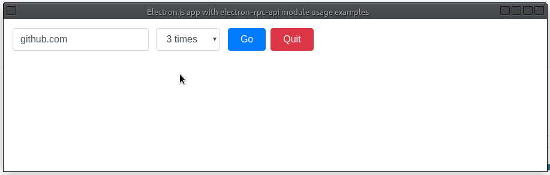

Electron.js app with [electron-rpc-api](https://github.com/vladimiry/electron-rpc-api) module usage examples.

## Getting started

0. Make sure you run `npm v7+` (comes with `Node.js v15+`).
1. Run `yarn --pure-lockfile` console command to install the dependencies.
2. Run `yarn start` console command to build and start the app.

